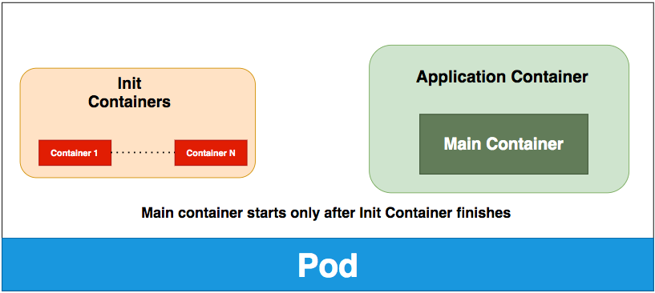

# Init Container

Init containers: specialized containers that run before app containers in a Pod. Init containers can contain utilities or setup scripts not present in an app image.
###### Understanding init containers
A Pod can have multiple containers running apps within it, but it can also have one or more init containers, which are run before the app containers are started.
Init containers are exactly like regular containers, except:
    Init containers always run to completion.
    Each init container must complete successfully before the next one starts.
If a Pods init container fails, the kubelet repeatedly restarts that init container until it succeeds. However, if the Pod has a restartPolicy of Never, and an init container fails during startup of that Pod, Kubernetes treats the overall Pod as failed.
Fro more detail: https://kubernetes.io/docs/concepts/workloads/pods/init-containers/
In my case I defined volume and changed default index.html of nginx via initcontainer busybox :
```bash
k create -f 12-init-container.yaml
k describe deploy nginx-deploy
```
Now expose your deployment:
If you set Port forward n your  editor or on your system you  can achieve to your deployment with these commands 
your forwarded port must be 8080 , thats it.
```bash
k expose deploy nginx-deploy --type NodePort --port 80
kubectl port-forward service/nginx-deploy 8080:80
```
So you can visit http://localhost:8080/ on your local machine.
You can scale up you deployments as below:
```bash
k scale deploy nginx-deploy --replicas=2
```
Now lets have a failed initcontainer:
```bash
k create -f 13-init-container-Failed.yaml
```
Now run these command to see whats heppened:
```bash
kga 
```
See the pod status and Restart count, also your deployment not ready and will not ready, lets describe 
```bash
k describe pod
#OR
k describe pod | grep State,Reason
#OR
k describe pod | grep Reason
```
and see Events lists 
```bash
k describe deployment 
```
You can see your command : "/dani" that ruined everything.
