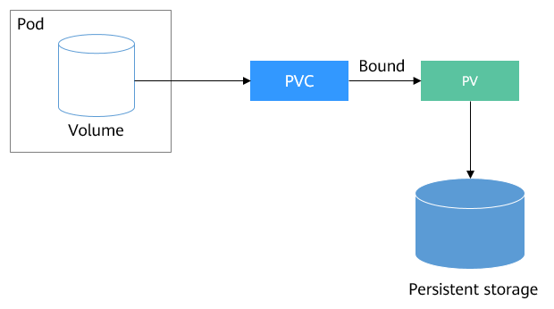

# PV-PVC


First of all we will create our pv also We set our path inner pv yaml file:
```bash
 hostPath:
    path: "/kube"
```
this path will create on your node in feature
```bash
k create -f 14-pv-hostpath.yaml
k get pv
```
Now create your pvc:
```bash
k create -f 14-pvc-hostpath.yaml
k get pv,pvc 
```
Your pvc STATUS is Bound and Volume is  pv-hostpath and on your pv you can see CLAIM value is default/pvc-hostpath
Befor creating pvc these values was: on your pv CLAIM : empty  and STATUS : Available
```bash
k describe pvc pvc-hostpath
#You can see your hostpath directory
k describe pv pv-hostpath
```
To delete your  pvc you can run:
```bash
k delete pvc pvc-hostpath
```
Now lets create a pod:
in define of our pod we set  persistentVolumeClaim: to claimName: pvc-hostpath and mountPath: /mydata ( inner pod)
with these options we use pvc and linked it to  /mydata on our pod:
```bash
k create -f 14-busybox-pv-hostpath.yaml
```
now go to container and create a file :
```bash
k exec busybox ls      ##### k exec -it busybox -- sh
```
You can see that /mydata path created as well.
Now touch a file:
```bash
k exec busybox touch /mydata/hello
```
now see which node used for your pod the ssh to it:
```bash
minikube ssh -n minikube-m02
ls /kube     #----hello is there
```
Lets delete our pod:
```bash
k delete pod busybox
```
pv and pvc will be exists 
```bash
k get pv,pvc
```
lets delete PVC :
```bash
k delete pvc pvc-hostpath
```
Now ssh again to our node:
```bash
minikube ssh -n minikube-m02
 ls /kube      #----hello exists
```
lets delete PV :
```bash
k delete pv pv-hostpath
minikube ssh -n minikube-m02
 ls /kube      #----hello exists 
```
As you saw /kube/hello doesnt delete.
We will set label to our "another" node via this command: 
```bash
k label node minikube-m03 demoserver=true
```
If you select wrong node to set label delete it via this command :
```bash
kubectl label node minikube-m02 demoserver-
```
Lets take a lokk to ur labeled node:
```bash
k get nodes -l demoserver=true
```
Now add nodeSelector to our pod yaml file:
```bash
added nodeSelector:
        demoserver: "true"
```
Now take a look to busybox container to see hello is there or not
```bash
k exec busybox ls /mydata/
```
There is no hello inner busybox 
same inner minikube-m03 that our pod deployed on it. but /kube directory created . 
Now lets touch something:
```bash
k exec busybox touch /mydata/something
k exec busybox ls /mydata/
minikube ssh -n minikube-m03
ls /kube  #something is there
```
exit and test it to another node:
```bash
minikube ssh -n minikube-m02
ls /kube  #Just old hello was there
```
Now delete pod and pv,pvc to take an action next step:
```bash
k delete pod --all
k delete pv,pvc --all
```
###### Change retain to DELETE:
Add persistentVolumeReclaimPolicy: Delete to your pv , I did in 14-pv-hostpath-RetainDelete.yaml
lets create pv and pvc :
```bash
k create -f  14-pv-hostpath-RetainDelete.yaml
k get pv 
# you can see RECLAIM POLICY value is Delete (not Retain)
k create -f 14-pvc-hostpath.yaml
k get pv,pvc 
```
If you delete pvc with RECLAIM POLICY set delete, our pv have to delete , but it doesnt, our pv remains:
```bash
k delete pvc --all
```
Just  STATUS of pv changed to Failed lets take alook why:
```bash
k describe pv  #OR k describe pv-hostpath
```
you can see this message on Events section:
Warning  VolumeFailedDelete  persistentvolume-controller  host_path delete only supports /tmp/.+ but received provided /kube
So if you chang /kube path to /tmp/kube , whn you delete pvc , your pv will be delete as well.
 
