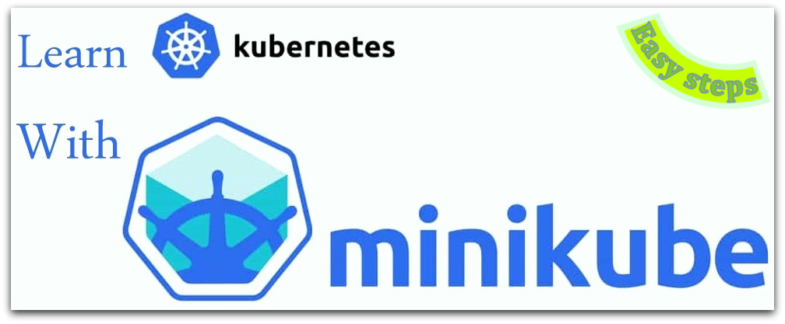

# Learn Kubernetes with Minikube (Easy Steps)
minikube is local Kubernetes, focusing on making it easy to learn and develop for Kubernetes.
All you need is Docker (or similarly compatible) container or a Virtual Machine environment, and Kubernetes is a single command away: minikube start
##### Requirements
The Kubernetes command-line tool, **kubectl**, allows you to run commands against Kubernetes clusters. You can use kubectl to deploy applications, inspect and manage cluster resources, and view logs. 
Install kubectl on Linux:
```bash
curl -LO "https://dl.k8s.io/release/$(curl -L -s https://dl.k8s.io/release/stable.txt)/bin/linux/amd64/kubectl"
cp kubectl /usr/local/bin/
chmod +x  /usr/local/bin/kubectl
```
In some cases you need these packages:
```bash
apt install -y socat
apt install -y  apt-transport-https
apt install -y conntrack
apt install -y  virtualbox virtualbox-ext-pack
```
##### Installation
To install the latest minikube stable release on x86-64 Linux using binary download:
```bash
curl -LO https://storage.googleapis.com/minikube/releases/latest/minikube-linux-amd64
install minikube-linux-amd64 /usr/local/bin/minikube
```
In my case I set up these very useful aliases (~/.bashrc) and autocompletion:
```bash
cat <<EOF >> ~/.bashrc
alias k='kubectl'
alias kga='watch -x kubectl get all -o wide'
alias kgad='watch -dx kubectl get all -o wide'
alias kcf='kubectl create -f'
alias wk='watch -x kubectl'
alias wkd='watch -dx kubectl'
alias kd='kubectl delete'
alias kcc='k config current-context'
alias kcu='k config use-context'
alias kg='k get'
alias kdp='k describe pod' 
alias kdes='k describe'
alias kdd='k describe deployment'
alias kds='k describe svc'
alias kdr='k describe replicaset'
#alias kk='k3s kubectl'
alias vk='k --kubeconfig'
alias kcg='k config get-contexts'
alias kgaks='watch -x kubectl get all -o wide -n kube-system'

EOF
```
I use these aliases for minikube,k3s,k3d,vcluster 

# Start your cluster
From a terminal with administrator access (but not logged in as root), run:
```bash
minikube start 
systemctl enable kubelet.service
```
If minikube fails to start, see the drivers [drivers](https://minikube.sigs.k8s.io/docs/drivers) page for help setting up a compatible container or virtual-machine manager.Your command will look like:
```bash
minikube start --vm-driver=none
```
# Check out
Let's see what we have done till now:
```bash
k cluster-info
kubectl get pods -A 
#OR
minikube kubectl -- get pods -A
```
# Table and Content
  - [Dashboard](../master/dashboard/README.md)
  - [Nodes](../master/nodes/README.md)
  - [DaemonSets](../master/DaemonSets/README.md)
  - [Job-CronJob](../master/jobs/README.md)
  - [Init Container](../master/InitContainer/README.md)
  - [PV-PVC](../master/PV-PVC/README.md)
  - [Secrets](../master/Secrets/README.md)
  - [ConfigMaps](../master/ConfigMaps/README.md)
  - [ResourceQuota](../master/ResourceQuota/README.md)
  - [NFS](../master/NFS/README.md)
  - [Statefulsets](../master/Statefulsets/README.md)
  - [Helm](../master/Helm/README.md)


# Kustomize
Kustomize is a standalone tool to customize Kubernetes objects through a kustomization file.
Since 1.14, Kubectl also supports the management of Kubernetes objects using a kustomization file. To view Resources found in a directory containing a kustomization file
### Overview of Kustomize

Kustomize is a tool for customizing Kubernetes configurations. It has the following features to manage application configuration files:
```bash
    generating resources from other sources
    setting cross-cutting fields for resources
    composing and customizing collections of resources
```
### Generating Resources
ConfigMaps and Secrets hold configuration or sensitive data that are used by other Kubernetes objects, such as Pods. The source of truth of ConfigMaps or Secrets are usually external to a cluster, such as a .properties file or an SSH keyfile. Kustomize has secretGenerator and configMapGenerator, which generate Secret and ConfigMap from files or literals.

### Setting cross-cutting fields
It is quite common to set cross-cutting fields for all Kubernetes resources in a project. Some use cases for setting cross-cutting fields:

```bash
    setting the same namespace for all Resources
    adding the same name prefix or suffix
    adding the same set of labels
    adding the same set of annotations
```
### Composing and Customizing Resources
It is common to compose a set of Resources in a project and manage them inside the same file or directory. Kustomize offers composing Resources from different files and applying patches or other customization to them.
### Composing
Kustomize supports composition of different resources. The resources field, in the kustomization.yaml file, defines the list of resources to include in a configuration. Set the path to a resource's configuration file in the resources list. 

```bash
git clone https://github.com/RFinland/Minikube.git
cd kustomize
k create -f  nginx-deployment.yaml
k create -f  nginx-svc.yaml
kga
```
wait for everything goes ready, take a look at pod,deployment and svc name
```bash
service/nginx
pod/nginx-0605556
deployment.apps/nginx 
```

now want to change our deployment,service and pod names without change our yaml files once by once:
create kustomize.yaml file and set resources that we want to change:
```bash
apiVersion: kustomize.config.k8s.io/v1beta1
kind: Kustomization
namePrefix: dev-
resources:
- nginx-deployment.yaml
- nginx-svc.yaml
```
now take a look what we got before applu our changes just run this command in your kustomize directory:
```bash
kubectl kustomize 
#OR 
 kubectl kustomize ./
```
as you'll see namePrefix shown. lets apply this changes to our deployments,svc 
```bash
kubectl apply -k $PWD
kga
```
[for more kustomize options](https://kubernetes.io/docs/tasks/manage-kubernetes-objects/kustomization/)

# Kustomize Helm
Let's create a sample helm project:
```bash
cd Minikube
mkdir -p kustomize-helm
cd kustomize-helm/
helm create helloworld
#Remove unnecessary files:
rm -rf helloworld/templates/*
rm helloworld/values.yaml
rm -rf helloworld/charts/
```

Setup of our pod placed in helloworld/templates/pod.yaml: 
```bash
cat <<EOF > helloworld/templates/pod.yaml
apiVersion: v1
kind: Pod
metadata:
  name: helloworld
spec:
  restartPolicy: Never
  containers:
  - name: hello
    image: alpine
    env:
    command: ["/bin/sh","-c"]
    args: ["/bin/echo Hello! My company name is {{ .Values.companyName}}"]
EOF	
```

Setup of our values placed in helloworld/values.yaml: 
```bash	
cat <<EOF > helloworld/values.yaml
companyName: ABC Company
EOF	
```	
Lets install this app:
```bash	
helm install helloworld helloworld
#take a look to logs:
k logs -f helloworld
```	
Result:
companyName: ABC Company
as you can see the 
```bash
 args: ["/bin/echo Hello! My company name is {{ .Values.companyName}}"]
 ```
filled by what we wrote inner values.yaml file:
```bash
 companyName: ABC Company
 ```
 
Now lets change it with kusomize:
we just added employeeName and employeeDepartment as below:
```bash
   - /bin/echo My name is {{ .Values.employeeName}}. I work for {{ .Values.employeeDepartment}} department. Our company name is {{ .Values.companyName}}
```
 let create kustomization.yaml :
```bash	
cat <<EOF > kustomization.yaml
patchesJson6902:
- target:
    version: v1
    kind: Pod
    name: helloworld
  patch: |-
    - op: replace
      path: /spec/containers/0/args
      value: ["/bin/echo My name is {{ .Values.employeeName}}. I work for {{ .Values.employeeDepartment}} department. Our company name is {{ .Values.companyName}}"]
resources:
- helloworld/templates/pod.yaml
EOF	
```	
look at the kustomize build when we are going to create new pod then save it in helloworld/templates/pod1.yaml file:
```bash	
kustomize build > helloworld/templates/pod1.yaml
cat  helloworld/templates/pod1.yaml
```
Result:
```bash	
Result:
apiVersion: v1
kind: Pod
metadata:
  name: helloworld
spec:
  containers:
  - args:
    - /bin/echo My name is {{ .Values.employeeName}}. I work for {{ .Values.employeeDepartment}}
      department. Our company name is {{ .Values.companyName}}
    command:
    - /bin/sh
    - -c
    env: null
    image: alpine
    name: hello
  restartPolicy: Never
```	
Modify values:
```bash	
cat <<EOF > helloworld/values.yaml
employeeName: Chris
companyName: Startup1
employeeDepartment: MDD
EOF
```	
take a look to new values file:
```bash	
cat helloworld/values.yaml
```	
Lets delete helloworld app then install it with new envs:
```bash	
helm ls
helm delete helloworld
helm install helloworld helloworld
#DONT mention on Error: INSTALLATION FAILED: pods "helloworld" already exists
```	
then Logs will be changed to:
```bash	
k logs -f helloworld
#YOUR new envs HERE
#Hello! My company name is Startup1
```	
Export helm template helloworld to podProd.yaml:
```bash	
rm helloworld/templates/pod.yaml
helm template helloworld > podProd.yaml
cat podProd.yaml
```	
Result:
```bash	
# Source: helloworld/templates/pod1.yaml
apiVersion: v1
kind: Pod
metadata:
  name: helloworld
spec:
  containers:
  - args:
    - /bin/echo My name is Chris. I work for MDD
      department. Our company name is Startup1
    command:
    - /bin/sh
    - -c
    env: null
    image: alpine
    name: hello
  restartPolicy: Never
```	

Lets add some new labels:
```bash	
cat <<EOF > kustomization.yaml
commonLabels:
  metrics: level1
resources:
- podProd.yaml

EOF
```	
Export kustomize build to podProd2.yaml:
```bash	
kustomize build  > podProd2.yaml
cat  podProd2.yaml
```	
Result:
```bash	
apiVersion: v1
kind: Pod
metadata:
  labels:
    metrics: level1
  name: helloworld
spec:
  containers:
  - args:
    - /bin/echo My name is Chris. I work for department MDD. Our company name is Startup1
    command:
    - /bin/sh
    - -c
    env: null
    image: alpine
    name: hello
  restartPolicy: Never
```	
Make sure app deleted:
```bash	
helm delete helloworld
k create -f podProd2.yaml
```
Now lets take a look to our new changes:
```bash		
kdp helloworld | less
kdp helloworld |  grep metrics
```	

Other Example:
```bash		
helm template discourse bitnami/discourse > discourse.yaml
cat discourse.yaml
```		
Set some ens:
```bash		
cat <<EOF > kustomization.yaml
commonLabels:
  env: prod
  metrics: level2
resources:
- discourse.yaml

EOF
```
Create the app:
```bash		
k create -k .
```		
Result:
```bash		
serviceaccount/discourse-redis created
configmap/discourse-redis-configuration created
configmap/discourse-redis-health created
configmap/discourse-redis-scripts created
configmap/discourse created
secret/discourse-postgresql created
secret/discourse-discourse created
service/discourse-postgresql created
service/discourse-postgresql-headless created
service/discourse-redis-headless created
service/discourse-redis-master created
service/discourse created
statefulset.apps/discourse-postgresql created
statefulset.apps/discourse-redis-master created
```		
Take a look to our deployed envs:
```bash		
k describe  pod/discourse-redis-master-0  | grep metrics
```		

# Horizontal Pod Autoscaler or (HPA) CPU
First ,We have to enable metrics-server addons
```bash
minikube addons list
minikube addons enable metrics-server
#to disable addon:
minikube addons disable  metrics-server
```
then : 
```bash
minikube start   #maybe its not nesseccary
k top pods -n kube-system
k top nodes -n kube-system
k top pods 
k top nodes
k get services -n kube-system   
#OR 
kubectl get svc -n kube-system 
#You will see the metrics-server as a service 
k get pods -n kube-system
#You will see the metrics-server-77c99ccb96-htgtc as a pod
k get deployments -n kube-system
#You will see the metrics-server  as a deployment
kubectl logs -n kube-system deploy/metrics-server
#Logs of metrics-server deployment 
```
Lets create our deployment :
```bash
nano 21-php-apache.yaml
```
in the container section you see:
```bash
        resources:
          limits:
            cpu: 100m
          requests:
            cpu: 100m
#these lines are our metric-server (limits)
```
then:
```bash
kubectl apply -f 21-php-apache.yaml
```
Then define your HorizontalPodAutoscaler(HPA):
We set maxReplicas to 5 and minReplicas to  1 and   targetCPUUtilizationPercentage to 20%
```bash
k create -f 21-hpa.yaml
#OR use this commnd: 
kubectl autoscale deployment php-apache --cpu-percent=20 --min=1 --max=5
kga
```
Now lets create some trafic inner pod:
```bash
k exec -it pod/php-apache-5b7bcbc4f4-ng49f -- sh
```
You can run "yes" or "apt update" or ...
open new termianl and run 
```bash
kga
```
you will see minikube create new pods to handle trafic, and max pods was 5.

Now lets terminate yes/apt update  command with press ctrl+c , then you will see new pods will be deleted automatically after less more 7 minutes.
# Horizontal Pod Autoscaler or (HPA) Memory
Make sure  metrics-server addon is enabled.
```bash
minikube addons enable metrics-server
```
Lets create our deployment :
```bash
nano 22-nginx-mem.yaml
```
in the container section you see:
```bash
        resources:
          limits:
            memory: 1Gi
          requests:
            memory: 0.5Gi
```
#these lines are our metric-server (limits)
```bash
k create -f 22-nginx-mem.yaml
```
Then define your HorizontalPodAutoscaler(HPA):
```bash
k create -f 22-hpa-mem.yaml
```
Then lets make some trafic:
```bash
k exec -it pod/php-apache-6856c856bd-g9mgk  -- sh
```
inside container: 
```bash
apt update
apt install stress
stress --vm 2 --vm-bytes 200M 
```
out of your pod, run:
```bash
kga
```
as you see new pods created, after you terminate stress , new pods will terminate after 6-7 minutes.
# Disruptions

This guide is for application owners who want to build highly available applications, and thus need to understand what types of disruptions can happen to Pods.

It is also for cluster administrators who want to perform automated cluster actions, like upgrading and autoscaling clusters.
Voluntary and involuntary disruptions

Pods do not disappear until someone (a person or a controller) destroys them, or there is an unavoidable hardware or system software error.

We call these unavoidable cases involuntary disruptions to an application. Examples are:

    a hardware failure of the physical machine backing the node
    cluster administrator deletes VM (instance) by mistake
    cloud provider or hypervisor failure makes VM disappear
    a kernel panic
    the node disappears from the cluster due to cluster network partition
    eviction of a pod due to the node being out-of-resources.

Except for the out-of-resources condition, all these conditions should be familiar to most users; they are not specific to Kubernetes.

We call other cases voluntary disruptions. These include both actions initiated by the application owner and those initiated by a Cluster Administrator. Typical application owner actions include:

    deleting the deployment or other controller that manages the pod
    updating a deployments pod template causing a restart
    directly deleting a pod (e.g. by accident)

Cluster administrator actions include:

    Draining a node for repair or upgrade.
    Draining a node from a cluster to scale the cluster down (learn about Cluster Autoscaling ).
    Removing a pod from a node to permit something else to fit on that node.

These actions might be taken directly by the cluster administrator, or by automation run by the cluster administrator, or by your cluster hosting provider.

Ask your cluster administrator or consult your cloud provider or distribution documentation to determine if any sources of voluntary disruptions are enabled for your cluster. If none are enabled, you can skip creating Pod Disruption Budgets.

    Caution: Not all voluntary disruptions are constrained by Pod Disruption Budgets. For example, deleting deployments or pods bypasses Pod Disruption Budgets.

First create your dployment:
```bash
k create deploy nginx --image nginx
#Scale up to 4
k scale deploy nginx --replicas=4
#Define our Pod Disruption Budget:
k create pdb pdbdemo --min-available 50% --selector "app=nginx"
#OR you can use yaml file : k create -f 23-pdb.yaml
#list of PDB:
k get pdb
#Describe of PDB
k describe pdb pdbdemo
```
Now if you drain a node :
```bash
k drain minikube-m03 --ignore-daemonsets
#( to undrain : kubectl uncordon minikube-m03)
```
You will see your pod deployed on another node, and stayed 4 as you declare in replicas=4
```bash
 #delete all of your pdbs:
 k delete pdb  --all
 ```
 
 

# VerticalPodAutoscaler(VPA)
Make sure metrics-server addon is enabled.
```bash
minikube addons enable metrics-server
```
List of VPAs: 
```bash
k get vpa
```

Then we need to autoscalar:
```bash
git clone https://github.com/RFinland/autoscaler.git
cd ~/Minikube/autoscaler/vertical-pod-autoscaler
```
run:
If you already have a autoscaler run :
```bash
./hack/vpa-down.sh
#OR to create:
./hack/vpa-up.sh
```
To print YAML contents with all resources that would be understood by kubectl diff|apply|... commands, you can use
```bash
./hack/vpa-process-yamls.sh print
```
Lets see some change after install autoscaler:
```bash
k get pods -n kube-system
```
As you see:
vpa-admission-controller
vpa-recommender
vpa-updater
Added as well.

Then :
#We set update : Off
Lets create VerticalPodAutoscaler(VPA):
```bash
k create -f  24-vpa-updateModeOff.yaml
k get vpa
k describe vpa my-vpa
```
```bash

nano 24-VPA-Deployment-Labeled.yaml
```
As you can see We have to set selector so we have to set label to our nodes :
```bash
k label node minikube-m02 app=my-app-deployment
k label node minikube-m03 app=my-app-deployment
```
Then 
```bash
k create -f  24-VPA-Deployment-Labeled.yaml
kga
k get vpa 
```
When PROVIDED setted to True then run :
```bash
k describe vpa my-vpa
```
You will see Recommendation:
```bash
  Recommendation:
    Container Recommendations:
      Container Name:  my-container
      Lower Bound:
        Cpu:     25m
        Memory:  262144k
      Target:
        Cpu:     25m
        Memory:  262144k
      Uncapped Target:
        Cpu:     25m
        Memory:  262144k
      Upper Bound:
        Cpu:     95051m
        Memory:  99371500k
```
 Lets set update : Auto , so 
 ```bash
 k delete deployment --all 
 k delete vpa my-vpa  
```
Now we will create a deployment with limit resources :
```bash
k create -f  24-VPA-Deployment-Labeled-Limits.yaml
k describe pod/my-app-deployment-6b9df99b4-fpb5h | less
```
As you can see there: 
```bash
    Requests:
      cpu:        100m
      memory:     50Mi
```
Now lets create VPA with update Auto :
```bash
k create -f  24-vpa-updateModeAuto.yaml
```
after a while, pods recreated automatically, lets describe our new pods and VPA:
```bash
k describe vpa my-vpa
```
#Target: Cpu:     587m and  Memory:  262144k will set to pods
```bash
k describe pod/my-app-deployment-6b9df99b4-4jrgr | less
```
As you can see:
```bash
    Requests:
      cpu:        548m
      memory:     262144k
```

# Remote access to cluster
### On your client (your laptop ,... )
run:
```bash
mkdir ~/.minikube_remote
cd ~/.minikube_remote
```
Then copy ca.crt,client.crt,client.key and kubeconfig:
```bash
#change user and ip as yours
scp admin@192.168.1.209:.minikube/ca.crt .
scp admin@192.168.1.209:.minikube/profiles/minikube/client.crt .
scp admin@192.168.1.209:.minikube/profiles/minikube/client.key .
#copy minikube config file:
scp admin@192.168.1.209:~/.kube/config /.kube
```
Change the server,certificate-authority,client-certificate and client-key lines inner config file to use the host ip and the port we just opened,Your config file will be similar as:
```bash
cat <<EOF > ~/.kube/config
apiVersion: v1
clusters:
- cluster:
    certificate-authority: ../.minikube_remote/ca.crt
    server: https://kubernetes:51999
  name: minikube
contexts:
- context:
    cluster: minikube
    user: minikube
  name: minikube
current-context: minikube
kind: Config
preferences: {}
users:
- name: minikube
  user:
    client-certificate: ../.minikube_remote/client.crt
    client-key: ../.minikube_remote/client.key
EOF
```
```diff
- NOTICE: you have to add "kubernetes" to your hosts file (/etc/hosts) on your client:
# 192.168.1.209 kubernetes
```
### On the server: 
Use socat as a TCP port forwarder, create socat-port.sh with this line [for more socat options](https://www.redhat.com/sysadmin/getting-started-socat)
For multiple connections, use the fork option:
```bash
touch socat-port.sh
cat <<EOF > socat-port.sh
socat TCP4-LISTEN:$1,fork TCP4:$2 &>/dev/null
EOF
```
Then run:
```bash
socat-port.sh 51999 192.168.49.2:8443 &
#OR just run this command:
socat TCP4-LISTEN:51999,fork TCP4:192.168.49.2:8443 &
```
### On the client:
You can see your server stuff as well, you can deploy your app from client to server 
Now you should be able to use the kubectl on the client(your laptop,...) to remote access the minikube on the Server
The best part about this is that kubectl port-forward should work as normal too in case you need to access services in your cluster.
Lets try this:
### On the client:
```bash
k  create deploy nginx --image nginx
```
As youll see your deployment done as well 
### On the Server: 
```bash
k expose deploy nginx --type NodePort --port 80
kubectl port-forward service/nginx --address='0.0.0.0' 8080:80
```
### On the client:
```bash
curl kubernetes:8080
```
Kill port command:
```bash
fuser -k 51999/tcp 
```

# Init Containers
This example defines a simple Pod that has two init containers. The first waits for myservice, and the second waits for mydb. Once both init containers complete, the Pod runs the app container from its spec section.

You can start this Pod by running:
```
git clone https://github.com/rfinland/Minikube.git
cd Minikube
cat myapp.yaml
kubectl apply -f myapp.yaml
#And check on its status with:
kubectl get -f myapp.yaml
#STATUS: Init:0/2 
```
or for more details:
```bash
kubectl describe -f myapp.yaml
#State:Waiting
```
To see logs for the init containers in this Pod, run:
```bash
kubectl logs myapp-pod -c init-myservice # Inspect the first init container
kubectl logs myapp-pod -c init-mydb      # Inspect the second init container
```

At this point, those init containers will be waiting to discover Services named mydb and myservice.
Here's a configuration you can use to make those Services appear:

```bash
cat services.yaml
kubectl apply -f services.yaml
kubectl get -f myapp.yaml
#STATUS: Running
```

[Development with DevSpace](https://github.com/rfinland/Minikube/tree/master/devspace/README.md)

# namespace stuck into termination
If your namespace stuck into termination state do these steps:
```bash
kubectl delete ns mynamespace
#in other terminal or ctrl+c on current termianl then run:
./delete_stuck_ns.sh mynamespace
```

Have fun!
