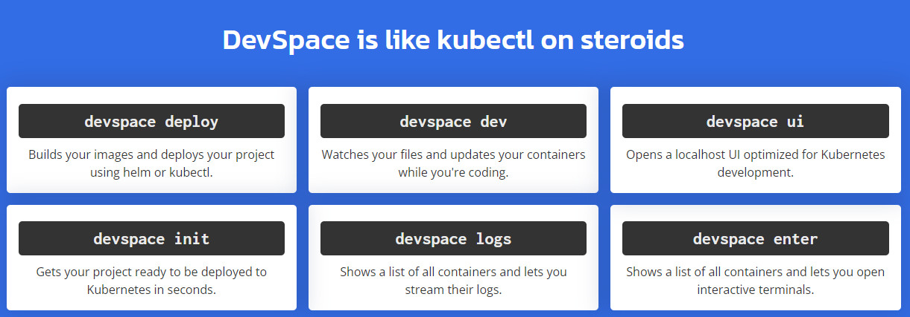

# Development with DevSpace

DevSpace allows you to develop applications directly inside a Kubernetes cluster.

The biggest advantages of developing directly inside Kubernetes is that your dev environment will be very similar to your production environment and you can have much greater confidence that everything will work in production when shipping new features.
To develop and deploy your project with DevSpace, you need a valid kube-context because DevSpace uses the kube-config file just like kubectl or helm.
Remote Cluster:

On Windows Powershell:
```bash
md -Force "$Env:APPDATA\devspace"; [System.Net.ServicePointManager]::SecurityProtocol = [System.Net.SecurityProtocolType]'Tls,Tls11,Tls12';
Invoke-WebRequest -UseBasicParsing ((Invoke-WebRequest -URI "https://github.com/loft-sh/devspace/releases/latest" -UseBasicParsing).Content -replace "(?ms).*`"([^`"]*devspace-windows-amd64.exe)`".*","https://github.com/`$1") -o $Env:APPDATA\devspace\devspace.exe;
$env:Path += ";" + $Env:APPDATA + "\devspace";
[Environment]::SetEnvironmentVariable("Path", $env:Path, [System.EnvironmentVariableTarget]::User);
```

make sure you placed kubeconfig,cert files and portforwarded 
if you can run kubectl on your system also you can run devspace too (after install devspace)

Use cluster alone:
```bash
run devspace --version to make sure everything is OK
devspace init
devspace use context mynewns 
#[done] √ Successfully set kube-context to 'minikube'
```
Start Development Mode
Create a folder for your sample project and use it as current directly to it then run the following command to start the development mode :
```bash
devspace dev
```
Result:
```bash
#Welcome to your development container!
This is how you can work with it:
- Run `npm start` to start the application
- Run `npm run dev` to start hot reloading
- Files will be synchronized between your local machine and this container
- Some ports will be forwarded, so you can access this container on your local machine via http://localhost:3000
```
Run `npm run dev` to start hot reloading
then visit you app page http://localhost:3000 here you go
Hello from index.js!
or visit:
http://localhost:8090
Now if you change the index.js file, because of hot reloading you can see your changes ater reresh your browser.

To purge your app :
```bash
devspace purge
```