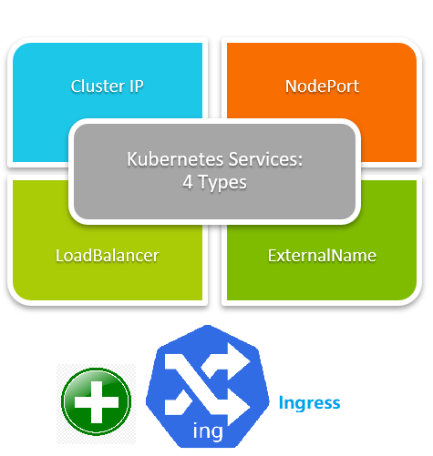

# Exposing applications using services



## Service Type ClusterIP
ClusterIP is the default Kubernetes service. Your service will be exposed on a ClusterIP unless you manually define another type.

A ClusterIP provides network connectivity within your cluster. It can’t normally be accessed from outside.
You use these services for internal networking between your workloads.

```bash
Traffic -> Proxy -> Service - in this case type =ClusterIP -> Pods
```
* **Deployment**

Here is a manifest for a Deployment:
```bash
cd services
cat my-deployment.yaml
kubectl apply -f my-deployment.yaml
```
Verify that three Pods are running:
```bash
kubectl get pods
```

* **Service**

Here is a manifest for a Service of type ClusterIP:
```bash
cat my-cip-service.yaml
```
create the Service:
```bash
kubectl apply -f my-cip-service.yaml
```
Wait a moment for Kubernetes to assign a stable internal address to the Service, and then view the Service:
```bash
kubectl get service my-cip-service --output yaml
```
The output shows a value for clusterIP:
```bash
spec:
  clusterIP: 10.43.109.148
```

Make a note of your clusterIP value for later.

* **Accessing your Service:-Inner pods**

List your running Pods:
```bash
kubectl get pods
```
In the output, copy one of the Pod name.
Get a shell into one of your running containers:
```bash
kubectl exec -it POD_NAME -- sh
```
Replace POD_NAME with the name of one of the Pods in my-deployment.
In your shell, install curl:
```bash
apk add --no-cache curl
```
In the container, make a request to your Service by using your cluster IP address and port 80. Notice that 80 is the value of the port field of your Service. This is the port that you use as a client of the Service.
```bash
curl CLUSTER_IP:80
```
Replace CLUSTER_IP with the value of clusterIP in your Service.
Your request is forwarded to one of the member Pods on TCP port 8080, 
which is the value of the targetPort field. 
Note that each of the Service's member Pods must have a container listening on port 8080.

The response shows the output of hello-app:
```bash
Hello, world!
Version: 2.0.0
Hostname: my-deployment-7d5868f7f-pjbrh
```

To exit the shell to your container, enter exit.

* **Accessing your Service:-In the host**

You could able to reach to the hello-app:
```bash
curl CLUSTER_IP:8080
```
* **Accessing your Service:-Out of the host**

You will be able to access your app via kubernetes proxy:
```bash
Traffic -> Proxy ->Service - in this case type ClusterIP -> Pods
```
Run your Proxy on any port:
```bash
kubectl proxy --port=8000
```
Then visit your Browser:
```bash
http://localhost:8000/api/v1/namespaces/default/services/my-cip-service/proxy/
```
The response of your browser shows the output of hello-app:
```bash
Hello, world!
Version: 2.0.0
Hostname: my-deployment-7d5868f7f-pjbrh
```


## Service Type NodePort
ClusterIP is the default Kubernetes service. Your service will be exposed on a ClusterIP unless you manually define another type.

A ClusterIP provides network connectivity within your cluster. It can’t normally be accessed from outside. 
You use these services for internal networking between your workloads.
Creating a NodePort will open that port on every node in your cluster. Kubernetes will automatically route port traffic to the service it’s linked to.
NodePort definitions have the same mandatory properties as ClusterIP services. The only difference is the change to type: NodePort.
The targetPort field is still required, as NodePorts are backed by a ClusterIP service.

```bash
Traffic -> Nodes -> Service - in this case type =nodePort -> Pods
```
* **Deployment**

Here is a manifest for a Deployment:
```bash
cat my-deployment-50000.yaml
```
Notice the env object in the manifest. The env object specifies that the PORT environment variable for the running container will have a value of 50000.
The hello-app application listens on the port specified by the PORT environment variable. 
So in this case, you are telling the container to listen on port 50000.
```bash
        env:
        - name: "PORT"
          value: "50000"
```

Also we changed the department in this case to make it specific.
Create the Deployment:
```bash
kubectl apply -f my-deployment-50000.yaml
```

Verify that three (names start with my-deployment-50000-)Pods are running:
```bash
kubectl get pods
```

* **Service**

Here is a manifest for a Service of type NodePort:
```bash
cat my-cip-service.yaml
```
In the service type will be set "type: NodePort" and "targetPort: 50000" as we set in the deployment also changed department.
Applying the above manifest will assign your NodePort a random port number from the range available to Kubernetes. 
This usually defaults to ports 30000-32767. You can manually specify a port by setting the ports.nodePort field
create the Service:
```bash
kubectl apply -f my-np-service.yaml
```
View the Service:
```bash
kubectl get service my-np-service --output yaml 
kubectl get service my-np-service --output yaml | grep nodePort
```
The output shows a nodePort value: 
```bash
...
  ports:
  - nodePort: 32255
    port: 80
    protocol: TCP
    targetPort: 50000
  selector:
...
```

Run this command:
```bash
netstat -plnt
```
As you can see the "0.0.0.0:32255" ready to catch requests:
```bash
curl http://localhost:32255/
```
Get a shell into one of your running containers:
```bash
kubectl exec -it POD_NAME -- sh
```
Replace POD_NAME with the name of one of the Pods in my-deployment-50000.
Run this command inside:
```bash
netstat -plnt
```
As you can see the "0.0.0.0:50000" exposed inner pod.

But as I wrote begining of this section Traffics must be send to Nodes , in our case we didnt have a EXTERNAL-IP for our nodes 
If you have a EXTERNAL-IP for your node:
```bash
kubectl get nodes --output wide
```

Create a firewall rule to allow TCP traffic on your node port
in our  case nodePort is 32255

and then visit NODE_IP_ADDRESS:NODE_PORT on your browser.

    NODE_IP_ADDRESS: the external IP address of one of your nodes
    NODE_PORT: your node port value.
The output is similar to the following:
```bash
Hello, world!
Version: 2.0.0
Hostname: my-deployment-50000-6cc6bd7b86-fszzw
```

## Service Type LoadBalancer
```bash
Traffic -> LoadBlancer -> Service - in this case type =LoadBalancer -> Pods
```
* **Deployment**

Here is a manifest for a Deployment:
```bash
cat my-deployment-50001.yaml
kubectl apply -f my-deployment-50001.yaml
```
Verify that three Pods are running:
```bash
kubectl get pods
```

* **Service**

Here is a manifest for a Service of type LoadBalancer:
```bash
cat my-lb-service.yaml
```
create the Service:
```bash
kubectl apply -f my-lb-service.yaml
```

View the Service:
```bash
kubectl get service my-lb-service --output yaml
```
The output shows a stable external IP address under loadBalancer:ingress:
```bash
...
ports:
  - nodePort: 30725
    port: 60000
    protocol: TCP
    targetPort: 50001
  selector:
    app: products
    department: sales
  sessionAffinity: None
  type: LoadBalancer
status:
  loadBalancer:
    ingress:
    - ip: 192.168.1.209
```

Access your Service:
In your browser's address bar, enter the following:
```bash
LOAD_BALANCER_ADDRESS:60000
in our case : 192.168.1.209:60000 Or localhost:60000
```
Replace LOAD_BALANCER_ADDRESS with the external IP address of your load balancer.

The response shows the output of hello-app:
```bash
Hello, world!
Version: 2.0.0
Hostname: my-deployment-50001-65d975b885-jljwl
```
Notice that the value of port in a Service is arbitrary. The preceding example demonstrates this by using a port value of 60000.

## Service Type ExternalName
A Service of type ExternalName provides an internal alias for an external DNS name.
Internal clients make requests using the internal DNS name, and the requests are redirected to the external name.

Here is a manifest for a Service of type ExternalName:
```bash
cat my-ex-service.yaml
kubectl apply -f my-ex-service.yaml
kg svc
```
In the preceding example, the DNS name is my-xn-service.default.svc.cluster.local.
When an internal client makes a request to my-xn-service.default.svc.cluster.local, the request gets redirected to example.com.
Using kubectl expose to create a Service

As an alternative to writing a Service manifest, you can create a Service by using kubectl expose to expose a Deployment.

To expose my-deployment, shown earlier in this topic, you could enter this command:
```bash
kubectl apply -f my-deployment.yaml

kubectl expose deployment my-deployment --name my-cip-service \
    --type ClusterIP --protocol TCP --port 80 --target-port 8080
```
To expose my-deployment-50000, show earlier in this topic, you could enter this command:
```bash
kubectl expose deployment my-deployment-50000 --name my-np-service \
    --type NodePort --protocol TCP --port 80 --target-port 50000
```
To expose my-deployment-50001, shown earlier in this topic, you could enter this command:
```bash
kubectl expose deployment my-deployment-50001 --name my-lb-service \
    --type LoadBalancer --port 60000 --target-port 50001
```

## Service Type Ingress
```bash
Traffic (visit rfinland.net/foo )-> Ingress -> Service -> Pods
```
An Ingress is actually a completely different resource to a Service so it has a diffrent section named ingress (not services)
You normally use Ingresses in front of your Services to provide HTTP routing configuration.
They let you set up external URLs, domain-based virtual hosts, SSL, and load balancing.
Setting up Ingresses requires an Ingress Controller to exist in your cluster.
The nginx-ingress is a popular standalone option that uses the NGINX web server as a reverse proxy to get traffic to your services.
You create Ingresses using the Ingress resource type. The kubernetes.io/ingress.class annotation lets you indicate which kind of Ingress you’re creating.
This is useful if you’re running multiple cluster controllers.

* **Nginx Ingress controller**
Install the Nginx Ingress controller for k3s without traefik:
```bash
kubectl apply -f https://raw.githubusercontent.com/kubernetes/ingress-nginx/controller-0.32.0/deploy/static/provider/cloud/deploy.yaml
```
* **Deployment**
Creating a Deployment
Here's a manifest for the first Deployment:
```bash
cat hello-world-1.yaml
kubectl apply -f hello-world-1.yaml
```
Creating a second Deployment
Here's a manifest for a second Deployment:
```bash
cat hello-world-deployment-2.yaml
kubectl apply -f hello-world-deployment-2.yaml
```

* **Service**
Creating a Service
Here's a manifest for a Service that exposes your first Deployment:
```bash
cat hello-world-service-1.yaml
kubectl apply -f hello-world-service-1.yaml
```
Creating a second Service
Here's a manifest for a Service that exposes your second Deployment:
```bash
cat hello-world-service-2.yaml
kubectl apply -f hello-world-service-2.yaml
```
* **Ingress**
Creating an Ingress
Here's a manifest for an Ingress:
```bash
cat my-ingress.yaml
kubectl apply -f my-ingress.yaml
```
View the Ingress:
```bash
kubectl get ingress my-ingress --output yaml
```
The output shows the IP address of the external HTTP(S) load balancer:
```bash
status:
  loadBalancer:
    ingress:
    - ip: 192.168.1.209
```
And your host: rfinland.net
define the host in your /etc/hosts :
```bash
192.168.1.209 rfinland.net
```
Access your Ingress:
Test the / path:
```bash
#curl hostname
#curl hostname/v2
curl rfinland.net
curl rfinland.net/v2
```

Using the traefik as an ingress controller. without any changes in the yaml files (even annotations).
Just deploy the traefik in your k3s (no need to nginx ingress controller anymore) then do exactly the previous step. 
```bash
#NOTICE: I'm gonna UNINSTALL THE K3s DONT RUN IT BEFORE THINKING ABOUT THESE STEPS
/usr/local/bin/k3s-uninstall.sh    -- Are you sure?
sudo rm -rf /var/lib/rancher  -- Are you sure?
curl -sfL https://get.k3s.io/ | sh -s - --docker 
kubectl apply -f hello-world-1.yaml 
kubectl apply -f hello-world-service-1.yaml 
kubectl apply -f hello-world-deployment-2.yaml 
kubectl apply -f hello-world-service-2.yaml 
kubectl apply -f my-ingress.yaml
cat /etc/hosts
curl rfinland.net
curl rfinland.net/v2
```
Using the ambassador as an ingress controller:
```bash
curl -sfL https://get.k3s.io/ | INSTALL_K3S_EXEC="--no-deploy traefik" sh -s - --docker 
kubectl apply -f https://www.getambassador.io/yaml/ambassador/ambassador-crds.yaml
kubectl apply -f https://www.getambassador.io/yaml/ambassador/ambassador-rbac.yaml
kubectl apply -f https://www.getambassador.io/yaml/ambassador/ambassador-service.yaml

kubectl apply -f hello-world-1.yaml 
kubectl apply -f hello-world-service-1.yaml 
kubectl apply -f hello-world-deployment-2.yaml 
kubectl apply -f hello-world-service-2.yaml 
kubectl apply -f my-ingress.yaml
cat /etc/hosts
curl rfinland.net
curl rfinland.net/v2
```

Here you go!
